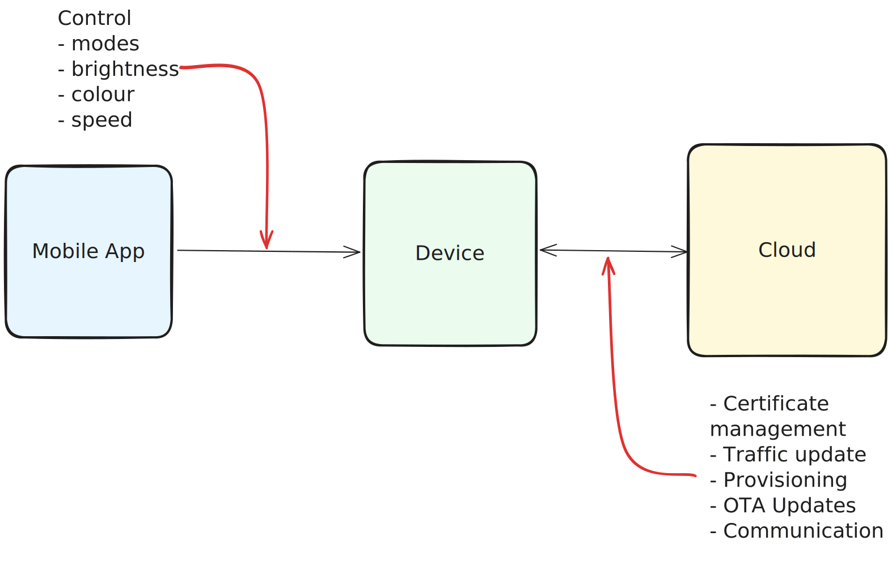
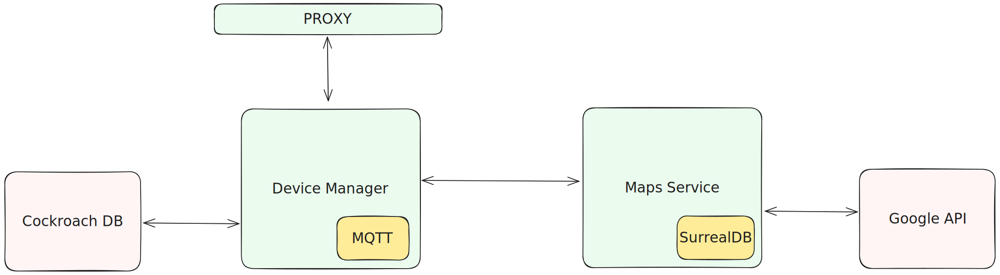

 

<h3 align="center">
    Nairobi Traffic PCB is the ultimate PCB artwork  
    showcasing the Nairobi traffic.
</h3>

 

    
    &nbsp;
    
    &nbsp;
    
    &nbsp;    
	

# What is Nairobi Traffic PCB?

Nairobi Traffic PCB is a PCB artwork that showcases the Nairobi traffic. It is a PCB that uses WS2812B LEDs to display the traffic in Nairobi. The PCB is powered by an Esp32 microcontroller and is programmed using the Arduino. The PCB is designed using KiCad. Not only does the PCB show traffic but is generates random art patterns. The PCB is designed to be modular and can be used in other projects.

## Features

- \>100 WS2812B LEDs
- Powered by an Esp32 microcontroller
- Modular design
- Configurable
- Controlled via Bluetooth LE
- Companion Flutter app

## How does it work?

The PCB is powered by an Esp32 microcontroller. The Esp32 is programmed using the Arduino. The Esp32 is connected to the WS2812B LEDs via the GPIO pins. The Esp32 has a Bluetooth LE module that is used to control the PCB. The Bluetooth LE module is used to configure the PCB and to control the PCB. The Bluetooth LE module is controlled by a Flutter app. The Flutter app is used to configure the PCB and to control the PCB. Cloud infrastructure is used to control the PCB if traffic mode is enabled. It fetches traffic data from google maps API and sends it to the PCB via MQTT.

## How to use it?

### Hardware

The PCB is designed to be modular. The PCB is powered by USB C. This is the only power source that is needed. The PCB has a Bluetooth LE module that is used to control the PCB.

### Mobile app

The mobile app is used to control the PCB. The mobile app is built using Flutter. The mobile app is used to configure the PCB and to control the PCB. The mobile app is used to configure the PCB by setting the number of LEDs, the brightness of the LEDs, the color of the LEDs, the mode of the LEDs, and the speed of the LEDs.

### Cloud infrastructure

The cloud infrastructure is used to control the PCB if traffic mode is enabled. It fetches traffic data from google maps API and sends it to the PCB via MQTT.

### Architecture

#### General architecture

#### Cloud architecture

## How to build it?

_TBD_

## How to contribute?

_TBD_

## How to support?

_TBD_

## How to contact?

_TBD_

## License

The project is licensed under the GNU GENERAL PUBLIC LICENSE. See the [LICENSE](LICENSE) file for more details.
