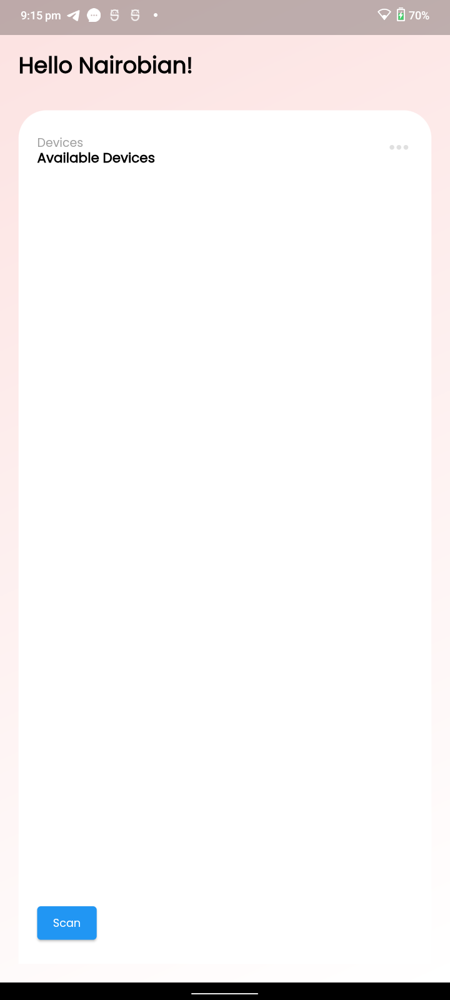

# Mobile

The mobile app is used to control the PCB. The mobile app is built using Flutter. The mobile app is used to configure the PCB and to control the PCB. The mobile app is used to configure the PCB by setting the number of LEDs, the brightness of the LEDs, the color of the LEDs, the mode of the LEDs, and the speed of the LEDs.

## How to build it?

### Prerequisites

- Flutter
- Android Studio
- BLE compatible device

### Run

```bash
flutter run
```

### Screenshots




### Build

```bash
flutter build apk
```

## How to contribute?

_TBD_

## How to support?

_TBD_
